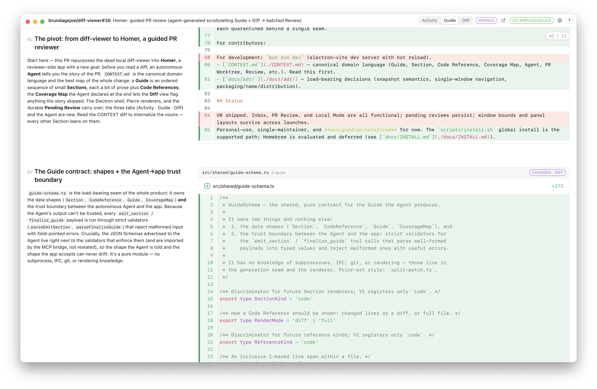

# Homer

Homer is a local, reviewer-side macOS desktop app for reviewing someone else's GitHub PR. You launch `homer <pr-url>` from inside the repo, and it spawns your local `claude` CLI as an autonomous **Agent** against an isolated checkout of the PR. The Agent streams back a **Guide** — a scrollytelling story of small **Sections** (tight prose plus the exact code each one is about, changed and relevant unchanged context) that walk you through the *intent* of the change. You read the Guide, then review the full **Diff** — which flags anything the Guide didn't narrate so nothing hides — drafting one batched **Review** you submit to GitHub. Named for the storyteller: Homer tells the story of a PR.



<sub>Homer reviewing its own pull request: the Guide tab, narrative Sections beside the code they explain.</sub>

## Prerequisites

- **macOS** (Apple Silicon).
- **[`bun`](https://bun.sh)** — Homer currently installs by building from source, so `bun` is required. `scripts/install.sh` runs `bun install` (pulling in `electron-vite`, `electron-builder`, etc.) and `bun run dist` for you, so `bun` is the only build tool you need to install yourself (network required on the first build). A prebuilt download is planned so this won't be needed later — see [Status](#status).
- **[`gh`](https://cli.github.com) authenticated** — Homer delegates all GitHub auth and API calls to the `gh` CLI. Run `gh auth login` once.
- **The [`claude`](https://claude.com/product/claude-code) CLI signed in on your Claude subscription** — Homer runs the review Agent on your existing subscription via your local `claude` CLI. **No API key is needed.** If `ANTHROPIC_API_KEY` (or `ANTHROPIC_AUTH_TOKEN`) is set in your environment, Homer strips it from the Agent by default so the run bills your subscription rather than the API.

## Install

Homer installs globally so you can run `homer` from any repo. From a clone of this repo:

```sh
./scripts/install.sh
```

This builds the app, copies `Homer.app` to `/Applications`, and installs a `homer` shim on your `PATH`. Then, from any repo:

```sh
cd ~/code/the-repo-the-pr-belongs-to
homer https://github.com/owner/repo/pull/123
```

The build is currently **unsigned**, so on first launch macOS Gatekeeper may warn that it can't verify the developer. `install.sh` clears the quarantine flag on the installed copy; if you still get blocked, right-click `/Applications/Homer.app` → **Open** once. See [`docs/INSTALL.md`](./docs/INSTALL.md) for the full install, repo-resolution, uninstall, and Gatekeeper details.

## Usage

Run `homer <pr-url>` from inside the local clone of the repo the PR belongs to. Homer needs that repo to fetch the PR's head SHA and read `gh` auth, so **run it from the right repo** (see `--repo` resolution below).

Homer opens a single window with three tabs — **Activity · Guide · Diff** — and lands on **Activity** (the PR's GitHub landing page: title, body, author, base ← head, existing threads) while the Guide generates in the background.

1. **Read the Guide.** Sections stream in as they're produced. Scroll through as one continuous scrollytelling story: the narrative pins while the code scrolls, and an `01/05` indicator tracks your place. The Guide is deliberately selective — it narrates the load-bearing arc, not every hunk.
2. **Do the Diff pass.** Switch to **Diff** for full GitHub-style review over the whole PR. It flags every change the Guide *didn't* narrate, so nothing slips past the story. This completeness pass is required — you can't finalize your Review until it's done.
3. **Draft your Review.** Add line comments (in the Guide, on changed lines; in the Diff, anywhere GitHub permits) plus a summary. They all accumulate into one batched **Pending Review**, which persists across app restarts.
4. **Submit** as approve, request-changes, or comment — it goes to the GitHub PR through the normal review flow.

If the author pushes new commits mid-review, a **Refresh** banner appears rather than changing anything silently: refreshing re-fetches, regenerates the Guide, and re-snapshots the diff; comments that still anchor carry over, and orphaned ones are flagged.

## Settings

The gear icon opens **Settings**, where you can customize the Guide-generation instructions (tone, what to emphasize). Leave the field empty to use the shipped default, or click **Reset to default** to restore it. The fixed tool contract and Section cap are always applied, so custom instructions can't break generation.

## Configuration

Environment variables tune the Agent without a rebuild:

| Variable | Effect |
| --- | --- |
| `DV_AGENT_MODEL` | Override the Agent model (default: `opus`, an Opus-class alias). |
| `DV_CLAUDE_BIN` | Path/name of the `claude` executable (default: `claude` on `PATH`). |
| `DV_GUIDE_STUB=1` | Use the offline stub Guide source instead of spawning `claude` — for dev/tests without spending a subscription run. |
| `DV_AGENT_USE_API_KEY=1` | Opt into API-key auth instead of your subscription (by default `ANTHROPIC_API_KEY` / `ANTHROPIC_AUTH_TOKEN` are stripped from the Agent). |
| `DV_REPO` | Scripting/testing escape hatch for the source repo path. |

**Repo resolution.** Homer resolves the source repo (where it fetches the head SHA and reads `gh` auth) in this order: the `--repo=<path>` launch flag → `DV_REPO` → the launch cwd. The global `homer` shim passes `--repo="$PWD"` because a packaged `.app` launches with cwd `/`; in the dev flow (`bin/homer`) the cwd is already the repo. See `resolveRepoPath` in [`src/main/launch.ts`](./src/main/launch.ts).

## Develop

```sh
bun install
bun run dev                                   # electron-vite dev server, hot reload
bun run build                                 # build to out/
bin/homer https://github.com/owner/repo/pull/123   # dev launcher (runs Electron against out/)
bun test                                      # unit tests (Bun runner)
bun run typecheck                             # tsc, node + web projects
bun run dist                                  # build + package the .app / .dmg (electron-builder)
```

Homer is built with Electron (via electron-vite), React + TypeScript, [Bun](https://bun.sh) as the package manager, the [`@pierre/diffs`](https://diffs.com) and [`@pierre/trees`](https://trees.software) renderers, Tailwind v4 + shadcn on Base UI primitives, `@octokit/rest` for the GitHub API, and SQLite for persistence. The architecture favors deep modules with narrow interfaces — the subprocess/Agent boundary, PR worktree management, Guide caching, and coverage mapping are each quarantined behind a single seam.

For contributors:

- [`CONTEXT.md`](./CONTEXT.md) — canonical domain language (Guide, Section, Code Reference, Coverage Map, Agent, PR Worktree, Review, etc.). Read this first.
- [`docs/adr/`](./docs/adr/) — load-bearing decisions (snapshot semantics, single-window navigation, packaging/name/distribution).

## Status

Personal-use, single-maintainer, and **unsigned/un-notarized** for now. The `scripts/install.sh` global install is the supported path; Homebrew is evaluated and deferred (see [`docs/INSTALL.md`](./docs/INSTALL.md)).
